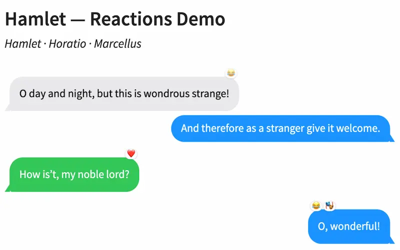

# quarto-revealjs-chat-bubbles

A Quarto extension that adds chat conversations to Reveal.js presentations, styled after iMessage, Slack, Discord, or Microsoft Teams. Messages can be revealed one at a time using Quarto fragments, and long conversations automatically scroll to keep the latest message visible.



## Installation

```bash
quarto add EmilHvitfeldt/quarto-revealjs-chat-bubbles
```

## Usage

Enable the plugin in your presentation's YAML front matter:

```yaml
format:
  revealjs: default
revealjs-plugins:
  - chat-bubbles
```

Then wrap messages in a `.chat` div and mark each message with a speaker class. Add `.fragment` to any message you want to reveal on a keypress.

```markdown
::: {.chat}
::: {.speaker-1}
Hey, are you coming tonight?
:::

::: {.fragment .speaker-2}
Yeah! What time does it start?
:::

::: {.fragment .speaker-1}
Doors open at 7
:::
:::
```

The first message can be left without `.fragment` to appear immediately when the slide opens.

## Speaker classes

Up to four speakers are supported. What a slot looks like depends on the theme: in iMessage it picks the side and bubble colour, in Slack and Discord it colours the avatar and name.

| Class | Default color |
|-------|---------------|
| `.speaker-1` | Blue |
| `.speaker-2` | Gray (slate for avatars) |
| `.speaker-3` | Green |
| `.speaker-4` | Purple |

By default `.speaker-1` is the sender, which in the alternating themes is the person on the right. Use the `self` attribute to point that at a different slot:

```markdown
::: {.chat self="2"}
```

### Legacy classes

The original geometric class names still work and need no migration:

| Legacy class | Equivalent |
|--------------|------------|
| `.bubble-right` | `.speaker-1` |
| `.bubble-left` | `.speaker-2` |
| `.bubble-left-2` | `.speaker-3` |
| `.bubble-left-3` | `.speaker-4` |

## Themes

Set `theme` on the `.chat` container. Each conversation carries its own theme, so a single deck can mix platforms.

| Theme | Layout | Looks like |
|-------|--------|-----------|
| `imessage` (default) | Alternating sides, tailed bubbles | iOS Messages |
| `slack` | Single column, avatar and name | Slack |
| `discord` | Single column, dark surface | Discord |
| `teams` | Alternating bubbles with avatars | Microsoft Teams |

```markdown
::: {.chat theme="slack" names="Jo,Meg,Amy"}
::: {.speaker-1}
I shall write a splendid book someday.
:::

::: {.fragment .speaker-2}
We are proud of you now, Jo.
:::
:::
```

### Names and avatars

Themes that show a name need a roster. `names` maps positionally onto the speaker slots, so the first name is `.speaker-1`:

```markdown
::: {.chat theme="discord" names="Hamlet,Horatio,Marcellus"}
```

Avatars default to the speaker's initial on a coloured background. To use images instead, pass `avatars` in the same slot order:

```markdown
::: {.chat theme="slack" names="Jo,Meg" avatars="jo.png,meg.png"}
```

A single message can override its name with `name="..."`.

Consecutive messages from the same speaker are grouped automatically in the themes that do that, so the avatar and name appear only on the first message of a run.

## Emoji reactions

Add `.reaction` fragments after a message to attach emoji reactions to it. Each reaction appears as a small pill when revealed, and is removed when navigating backwards. iMessage anchors the pill to the top corner of the bubble; the other themes place it in a row underneath.

The inline syntax is the most concise:

```markdown
::: {.chat}
::: {.speaker-1}
There are more things in heaven and earth, Horatio.
:::

[😮]{.fragment .reaction}
[👍]{.fragment .reaction}

::: {.fragment .speaker-2}
O day and night, but this is wondrous strange!
:::

[😂]{.fragment .reaction}
:::
```

The fenced div syntax also works and may be clearer when the emoji is ambiguous:

```markdown
::: {.fragment .reaction}
😂
:::
```

Multiple reactions on the same message stack side by side. Reactions can be added to any message, including ones that are not themselves fragments.

To react to an older message after the conversation has progressed, place the reaction after its target message in the source and use `fragment-index` to control when it appears:

```markdown
::: {.chat}
::: {.speaker-1}
Message one
:::

[😮]{.fragment .reaction fragment-index="3"}

::: {.fragment .speaker-2 fragment-index="1"}
Message two
:::

::: {.fragment .speaker-1 fragment-index="2"}
Message three
:::
:::
```

Here messages one, two, and three appear in order (steps 1–2), and then 😮 reacts to the first message at step 3. The reaction is linked to its target by DOM position, while `fragment-index` controls when it is revealed.

## Typing indicator

Add `.typing` to any `.fragment` message to turn it into a two-step reveal. The first keypress shows an animated three-dot typing indicator; the next keypress replaces the dots with the message text, with the bubble smoothly expanding to its full size.

```markdown
::: {.chat}
::: {.speaker-1}
Are you still there?
:::

::: {.fragment .speaker-2 .typing}
Sorry, was typing a really long reply.
:::
:::
```

Navigating backwards restores the typing indicator. The `.typing` class can be applied to any speaker class and works alongside reactions and other fragments.

## Overflow

If a conversation is too long to fit on the slide, the chat container will automatically scroll to keep the latest message visible. Navigating backwards scrolls back up.

## Customizing colors

Override the CSS custom properties in your own stylesheet:

```css
:root {
  --bubble-blue:   #FF3B30;  /* speaker 1 */
  --bubble-gray:   #E9E9EB;  /* speaker 2 */
  --bubble-green:  #34C759;  /* speaker 3 */
  --bubble-purple: #AF52DE;  /* speaker 4 */

  --bubble-slate:  #5A6B7B;  /* speaker 2's avatar and name */
}
```

`--bubble-slate` exists because speaker 2's near-white default works as a bubble fill but disappears when the same colour has to fill a small avatar or colour a username.
